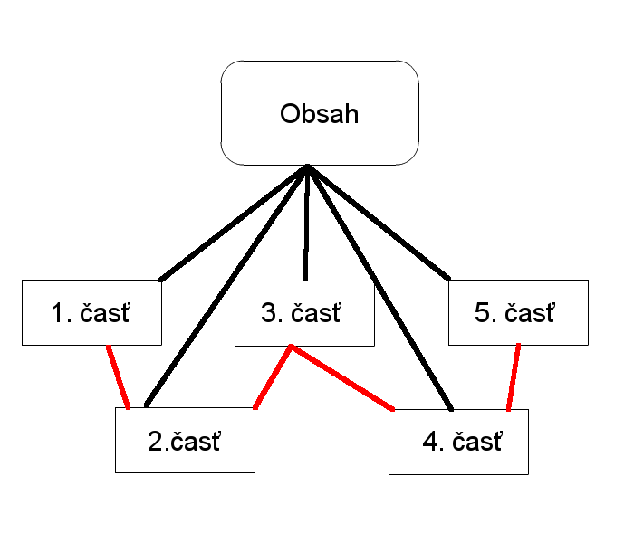

Predchádzajúca | [Obsah](README.md) | [Nasledujúca](01.md)

# Fedora

## 1.informácia o projekte

- Autori: Matúš Petrofčík
- Konzultant: (nikto)
- Predmet: Pedagogický softvér
- Názov projektu (Téma): Fedora - ideálne vývojové prostredie pre webdevelopment
- Cieľová skupina: VŠ
- Vývojové prostredia: JetBrains PhpStorm, GitHub, Hot Potatoes
- Stručný popis aplikácie: Elektronická učebnica
- Očakávaný vzdelávací efekt: Oboznámenie s prípravou vývojového prostredia pre webdevelopment

## 2.informácia o projekte

- Obsahová stránka (kapitoly, podkapitoly, elementy učiva): prosím pozrieť [obsah](README.md)
- Spôsoby interakcie študenta s aplikáciou: samoštútium, postupovanie podľa pokynov
- Grafová štruktúra aplikácie: prosím pozrieť nižšie v dokumentácii.
- Použité informačné zdroje: www.redhat.com, www.fedoraprojet.org, www.getfedora.org, www.getcomposer.org, ...

## Dokumentácia projektu

### NÁZOV

Fedora - ideálne vývojové prostredie pre webdevelopment

### AUTORI

Matúš Petrofčík (mgr-inf-jed)

### KONZULTANTI

(nikto)

### CIEĽOVÁ SKUPINA

Vysoká škola so zameraním na informatiku a webdevelopment

### HLAVNÝ ÚČEL

Elektronická učebnica predstavuje operačný systém Fedora, sprevádza inštaláciou a nastavením systému, neslobodného softvéru, LAMP-stacku, Composer-u... upozorňuje na prípadné problémy a ukazuje, ako ich riešiť.

### POUŽITÉ VÝVOJOVÉ PROSTREDIA

JetBrains PhpStorm, GitHub, Hot Potatoes

### HW A SW POŽIADAVKY

Elektronická učebnica je dočasne dostupná skrz github markdown súbory, vstupom je [README.md](README.md) súbor

### OBSAH APLIKÁCIE

Predstavenie Fedory, sprievodca inštaláciou a nastavením systému, neslobodného softvéru, LAMP-stacku, Composer-u...

### GRAFOVÁ ŠTRUKTÚRA APLIKÁCIE

červená - linky medzi kapitolami, čierna - linky medzi kapitolou a obsahom

### METODICKÉ POZNÁMKY

Elektronická učebnica sa dá použiť aj na hodinách, no najlepšie je samoštúdium. Jej zvládnutie predstavuje približne 3 hodiny (neráta sa doba inštalácie operačného systému).

### ĎALŠIE MOŽNÉ VYLEPŠENIA

V nasledujúcich dňoch by som chcel vydať ako články na sociálnej sieti pre programátorov - ITnetwork.cz, a v rámci získanej spätnej väzby doplniť chýbajúce informácie a opraviť prípadné nedostatky.

### POUŽITÉ INFORMAČNÉ ZDROJE

www.redhat.com, www.fedoraprojet.org, www.getfedora.org, www.getcomposer.org, vlastné skúsenosti, ...

### ZOZNAM SÚBOROV

1. [Úvod](01.md) - V tejto časti tutoriálu vám predstavím, čo to tá Fedora vlastne je, kde ju môžeme získať a ako si vytvoriť inštalačné médium s Fedorou.
2. [Inštalácia](02.md) - V tejto časti tutoriálu vás pomocou obrázkov stručne prevediem inštaláciou Fedory 23 Workstation.
3. [Neslobodný softvér, Git, SSH](03.md) - V tejto časti tutoriálu si predstavíme neslobodný softvér v rámci Fedory, nastavíme Git a SSH kľúč.
4. [LAMP](04.md) - V tejto časti tutoriálu sa budeme venovať inštalovaniu a konfigurácii LAMP-u.
5. [Composer](05.md) - V tejto časti tutoriálu sa budeme venovať inštalácii Composer-u a v krátkosti si ukážeme, ako s ním pracovať.

Predchádzajúca | [Obsah](README.md) | [Nasledujúca](01.md)
