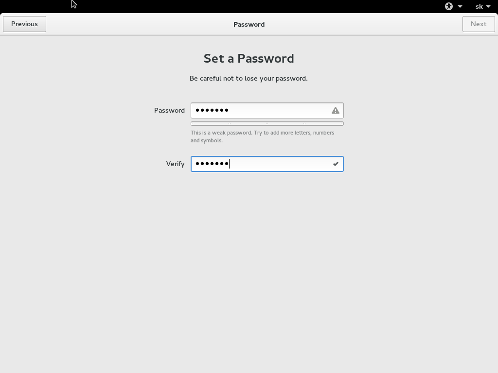

# Inštalácia

V tejto časti tutoriálu vás pomocou obrázkov stručne prevediem inštaláciou Fedory 23 Workstation.

Zdatnejší môžu túto časť preskočiť :)

## Nabootovanie inštalačného USB

Pri zapínaní počítača je potrebné nabootovať z nášho inštalačného USB-čka.
Najideálnejšie je zmeniť poradie bootovania diskov cez BIOS, no v niektorých
systémoch sa to dá obíjsť aj dočasne. Príkladom je moje Lenovo Thinkpad E540,
v ktorom stačí pri spúšťaní ťukať do klávesy F12, kedy získame možnosť výberu disku,
z ktorého chceme nabootovať, a v tom prípade si zvolíme naše inštalačné USB.

Po malej chvíli sa nám zobrazí spúšťacia obrazovka Fedory 23 Workstation,
a hneď potom sa spustí operačný systém z našeho USB-čka.

Hneď po spustení budeme mať na výber 2 možnosti, vyskúšať systém v rámci
live distribúcie (všetko pracuje z USB) a inštaláciu nového systému na
náš počítač. Kľudne si môžete systém vyskúšať, ale odporúčam rovno kliknúť
na inštaláciu, veď systém si potom môžete skúšať rýchlejšie :)

## Inštalácia

Ak ste zvolili vyskúšanie Fedory, musíte si otvoriť ľavý panel (myškou
buchnite do ľavého horného rohu, alebo kliknite na Activities), a zvoľte
inštaláciu Fedory.

### Výber jazyku inštalácie

Hneď na začiatku inštalácie si vyberáme jazyk, v ktorom bude inštalácia pokračovať.

Berte na vedomie, že zvolený jazyk sa automaticky nastaví ako jazyk celého
systému. Jazyk systému sa dá neskôr samozrejme zmeniť.

Ja si zvolím angličtinu a klikám v pravo dole na modré tlačítko `Continue`.

Vyskočí na nás nasledujúci výber, v ktorom máme možnosť nastaviť niekoľko dôležitých vecí.

### Lokalizácia

Čo sa lokalizácie týka, je vhodné nastaviť si rozloženie klávesnice a časovú zónu.

Nastavme si teda klávesnicu. Ja som Slovák, tak si chcem pridať slovenské rozloženie.
Pod zoznamom naľavo je také tlačítko `+`, pomocou ktorého je možné pridať klávesnicu.

Ak chceme aby naša nová klávesnica bola nadradená nad tou anglickou, označíme si ju,
a následne zmeníme jej pozíciu tlačítkami "hore" a "dole" pod zoznamom (vedľa toho `+`).

Ak sme s rozložením klávesnice spokojní, klikneme hore vľavo na tlačítko `Done` a vrhnime sa na časovú zónu.

Tu je nastavenie veľmi jednoduché, stačí zvoliť miesto na mape kliknutím myši, alebo výberom zo zoznamu.

V ľavo hore klikáme na `Done` a budeme pokračovať nastavením systému.

### Nastavenie systému

## 5 Spustenie nového systému a pár rád ##

### 5.1 Fedy a neslobodný software ###