# Inštalácia

V tejto časti tutoriálu vás pomocou obrázkov stručne prevediem inštaláciou Fedory 23 Workstation.

Jedná sa o časť pre úplnych začiatočníkov, aby vedeli čo ich počas inštalácie čaká a ako pokračovať.
Zdatnejší môžu túto časť smelo preskočiť :)

## Nabootovanie inštalačného USB

Pri zapínaní počítača je potrebné nabootovať z nášho inštalačného USB-čka.
Najideálnejšie je zmeniť poradie bootovania diskov cez BIOS, no v niektorých
systémoch sa to dá obíjsť aj dočasne. Príkladom je moje Lenovo Thinkpad E540,
v ktorom stačí pri spúšťaní ťukať do klávesy F12, kedy získame možnosť výberu disku,
z ktorého chceme nabootovať, a v tom prípade si zvolíme naše inštalačné USB.

Hneď po spustení systému budeme mať na výber 2 možnosti: vyskúšať systém v rámci
live distribúcie (všetko pracuje z USB) a inštaláciu nového systému na
náš počítač. Kľudne si môžete systém vyskúšať, ale odporúčam rovno kliknúť
na inštaláciu, veď systém si potom môžete skúšať rýchlejšie :)

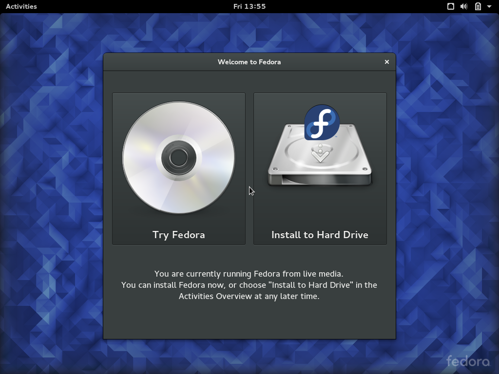

## Inštalácia

Ak ste zvolili vyskúšanie Fedory, musíte si otvoriť ľavý panel (myškou
buchnite do ľavého horného rohu, alebo kliknite na Activities), a zvoľte
inštaláciu Fedory.

### Výber jazyku inštalácie

Hneď na začiatku inštalácie si vyberáme jazyk, v ktorom bude inštalácia pokračovať.

Berte na vedomie, že zvolený jazyk sa automaticky nastaví ako jazyk celého
systému, ale to sa dá neskôr zmeniť.

Ja si zvolím angličtinu a klikám v pravo dole na modré tlačítko `Continue`.

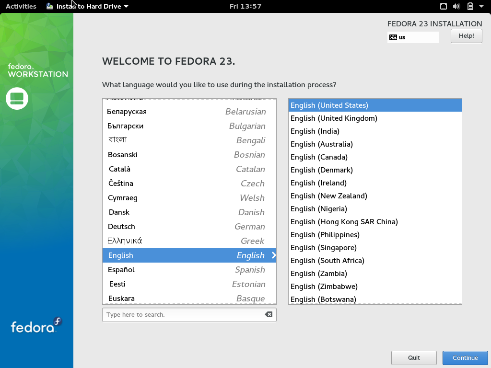

Vyskočí na nás nasledujúci výber, v ktorom máme možnosť nastaviť niekoľko dôležitých vecí.

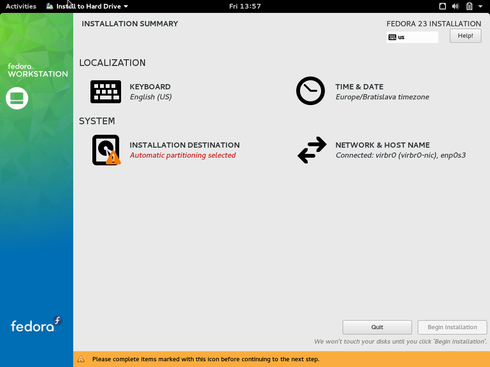

### Lokalizácia

Čo sa lokalizácie týka, je vhodné nastaviť si rozloženie klávesnice a časovú zónu.

Nastavme si teda klávesnicu. Ja som Slovák, tak si chcem pridať slovenské rozloženie.
Pod zoznamom naľavo je také tlačítko `+`, pomocou ktorého je možné pridať klávesnicu.
Potom si stačí vybrať zo zoznamu alebo vyhľadať podľa zadanej frázy.

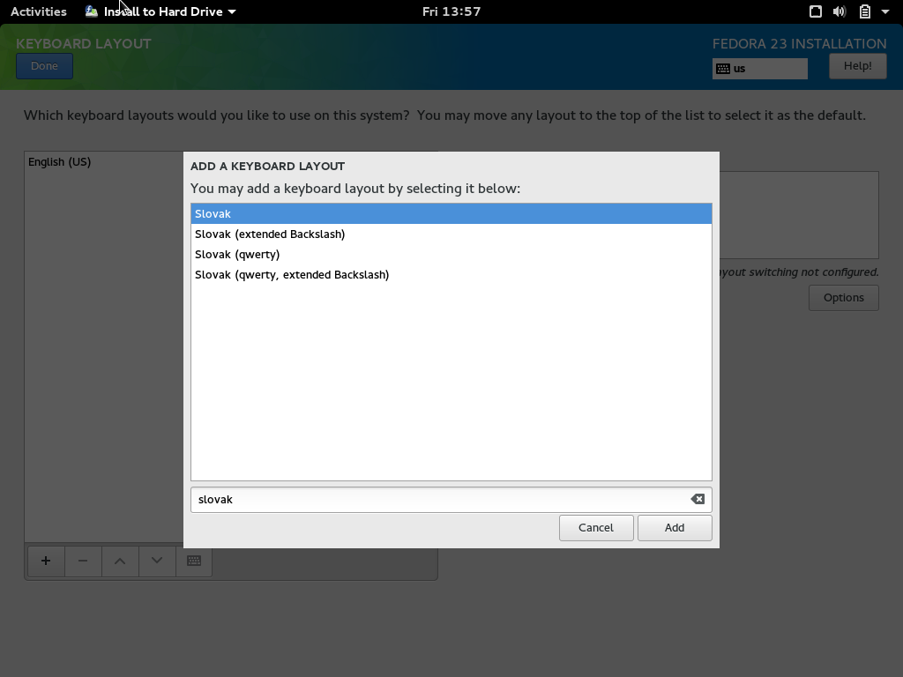

Ak chceme aby naša nová klávesnica bola nadradená nad tou anglickou, označíme si ju,
a následne zmeníme jej pozíciu tlačítkami "hore" a "dole" pod zoznamom (vedľa toho `+`).

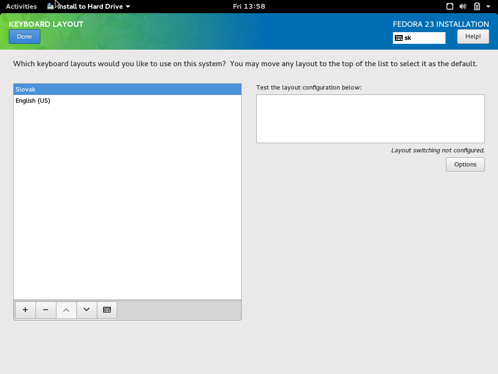

Ak sme s rozložením klávesnice spokojní, klikneme hore vľavo na tlačítko `Done` a vrhnime sa na časovú zónu.

Tu je nastavenie veľmi jednoduché, stačí zvoliť miesto na mape kliknutím myši, alebo výberom zo zoznamu.

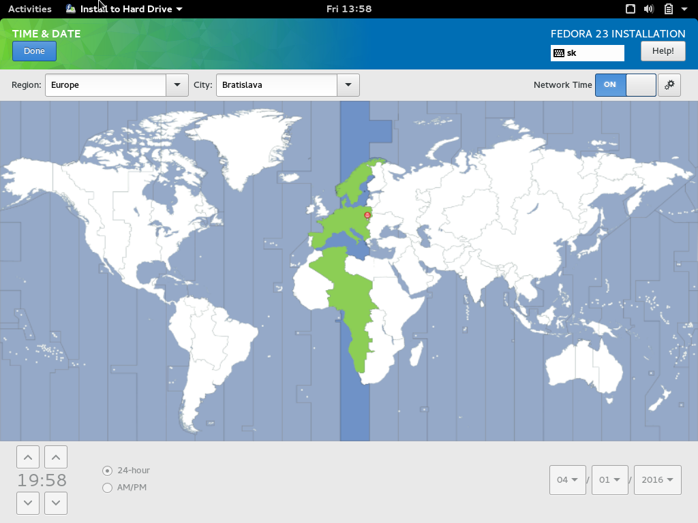

V ľavo hore klikáme na `Done` a budeme pokračovať nastavením systému.

### Nastavenie systému

Dôležitou časťou je rozloženie a nastavenie disku. Je potrebné vybrať disk,
na ktorý chceme fedoru nainštalovať (musí tam byť tá čierna fajočka).

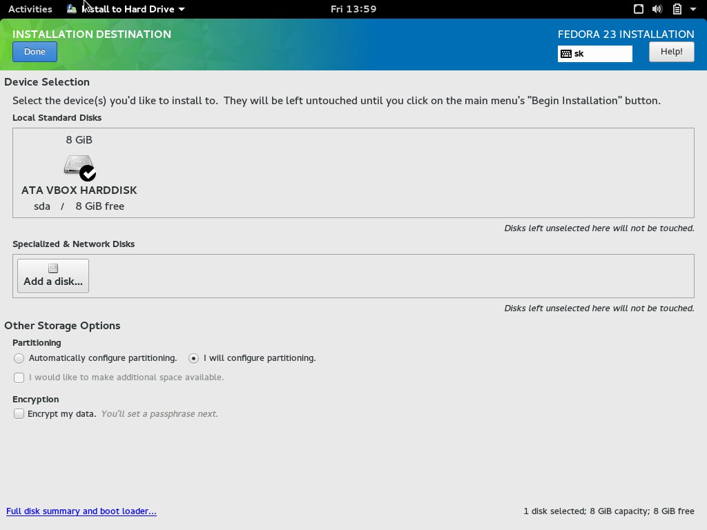

Následne máme možnosť automatického nastavenia partícií, ale aj možnosť
nastaviť si to sám. Ak plánujete na rovnakom disku dualboot (windows + linux),
tak vás mierne sklamem, nikdy som to nerobil a neviem ako to nastaviť správne.

Nižšie si môžete všimnuť voľbu šifrovať vaše dáta v `/home` zložke, čo sa hodí
napr. pri firemných počítačoch (z ukradnutého PC vám nikto dáta nezíska).

Ak si to chcete dať nastaviť automaticky, zaškrtnite `Automatically configure partitioning`
a v ľavo hore kliknite na `Done`.

Ak však chcete vyskúšať manuálnu konfiguráciu zaškrtnite `I will configure partitioning`
a sledujte nasledujúce 3 obrázky.

V prvom obrázku máme možnosť vytvoriť partície manuálne pomocou tlačítka `+`, a dokonca
tam znovu máme možnosť `Click here to create them automatically`, ktorú odporúčam.

Ja si ponechám LVM schému, a klikám na tlačítko `+`.

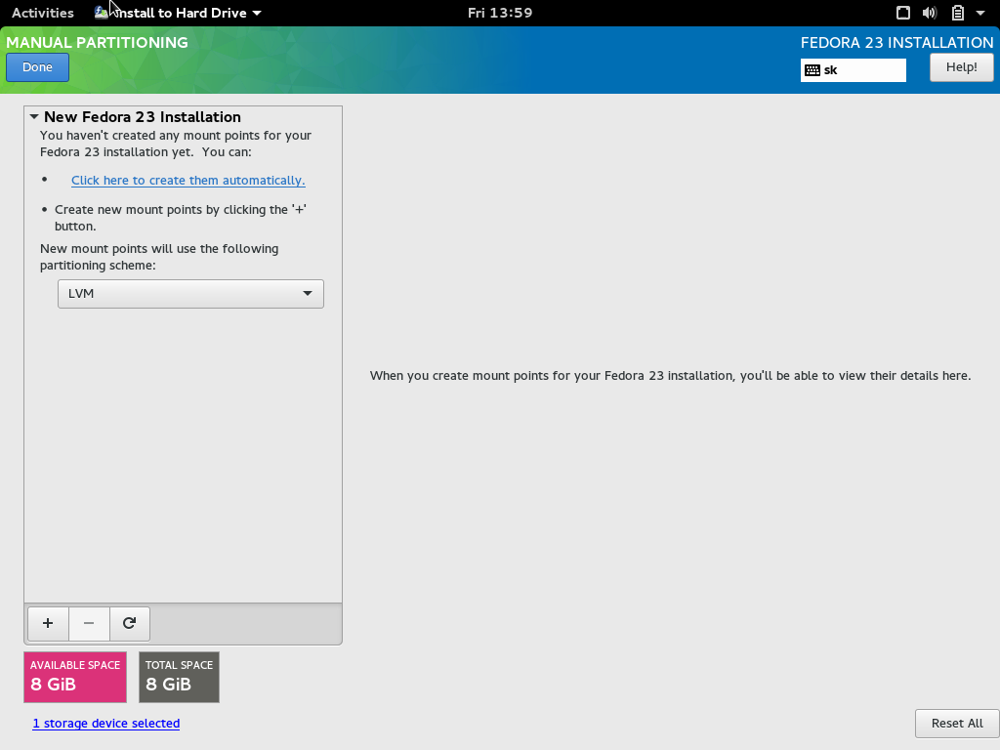

Dôležité je vytvoriť `/boot` partíciu, ja jej dávam 500MiB. V nej bude sídliť napr.
GRUB pre zavádzanie nášho systému pri bootovaní.

Ďalej si vytváram `swap`, ktorý by mal mať veľkosť ako vaša pamäť RAM. Počas behu systému
sa do neho ukladajú málo používané dáta z RAM pamäte (hlavne ak voľné miesto v RAM dochádza)
a taktiež slúži pre uloženie obsahu RAM pri hibernácii.

Zvyšok voľného miesta môjho 8GiB disku prenechávam partícii `/`, čo je vlastne koreňová zložka
celého systému.

Ak máte viac miesta na disku, Fedora sa snaží vytvoriť `/home`, ktorý slúži pre dáta užívateľa,
a vďaka tomu sú oddelené dáta systému od dát užívateľov (celkom chytré že?).

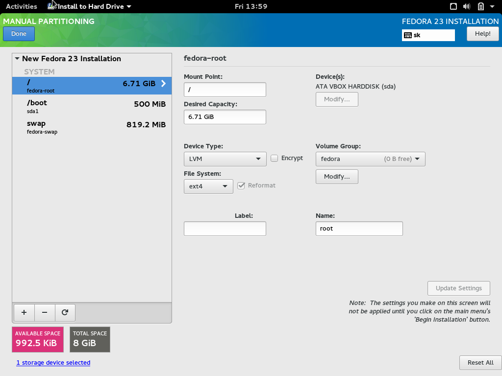

Po kliknutí na `Done` naľavo hore vyskočí sumarizácia, že čo som to vlastne s diskom porobil
a či som si fakt istý. Istý si som, klikám na `Accept changes`.

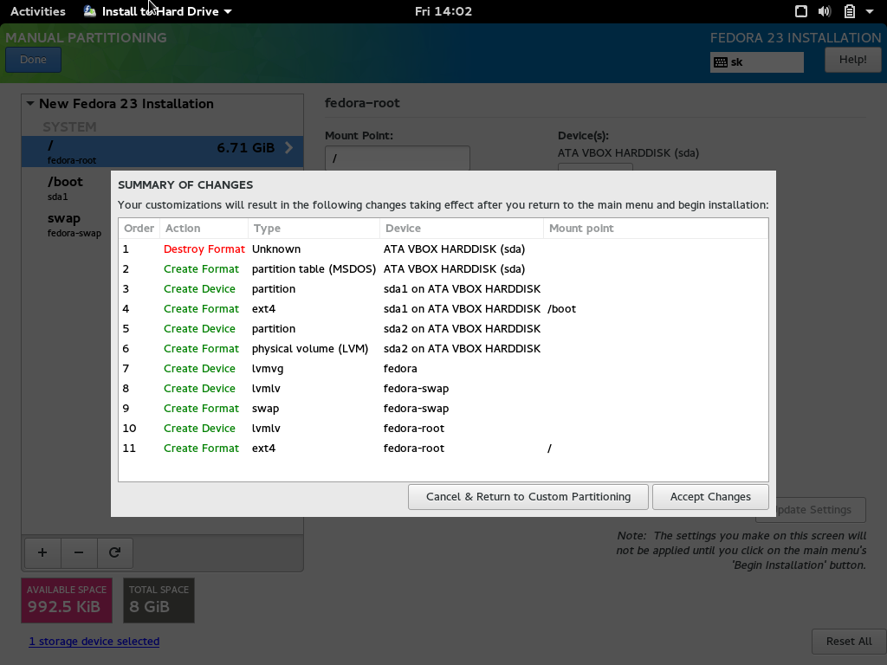

Disk už máme nastavený, a zdá sa že sieť sa nastavila sama (som pripojený káblom, pri wifi by sa pýtalo na sieť a heslo).

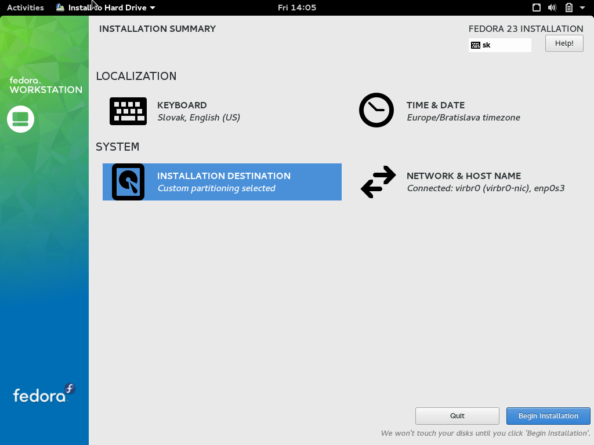

Kliknutím na `Begin installation` v pravo dole započneme inštaláciu.

### Nastavenie užívateľov

Naskytuje sa nám nasledovný pohľad.

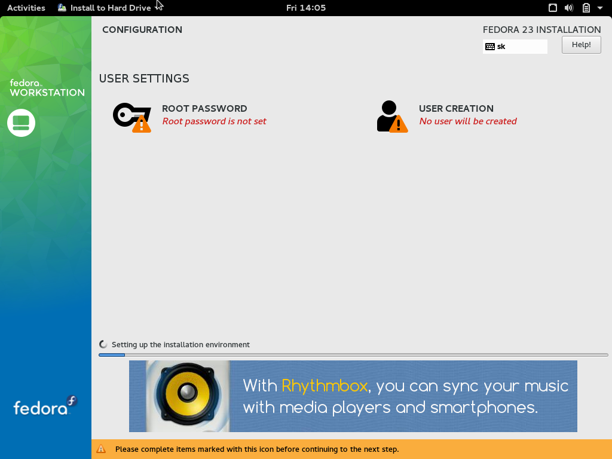

Naľavo máme nutnosť nastaviť heslo superužívateľovi `root` (veľmi dôležité!!!)
a napravo možnosť vytvoriť nového užívateľa (nepovinné, môžeme to spraviť aj neskôr).

Vyberám povinnosť a nastavujem superužívateľovi `root` jednoduché heslo, a klikám v ľavo hore na `Done`.

A keďže som ho zvolil extra jednoduché, dole mi oranžovo vypisuje varovanie, a musím klikať na `Done` viackrát.

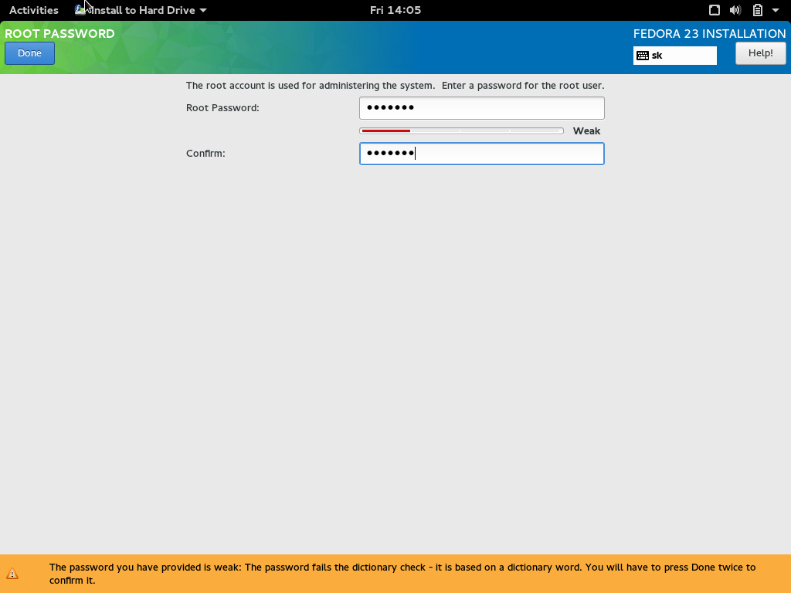

Mimochodom to heslo si zapamätajte, je to veľmi dôležité!

Dobrovoľne si môžete vytvoriť užívateľa (pre seba) už počas inštalácie. Ak to budete robiť,
je vhodné zaškrtnúť možnosť `Make this user administrator`, v budúcnosti to uľahčí pár vecí.

Vyzerá to asi nejak takto, ja som to ale neuložil aby som ukázal vytváranie užívateľa pri prvom spustení.

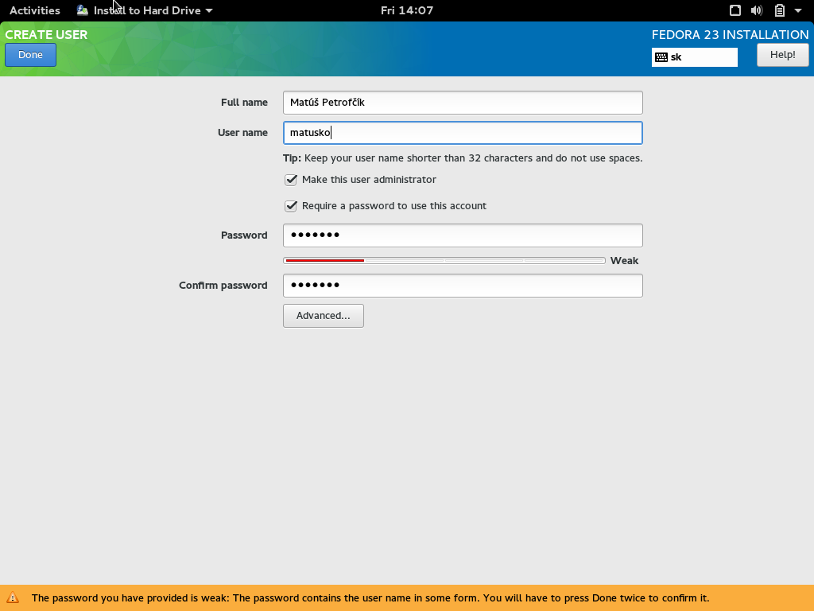

Počas inštalácie môžeme voliť heslá rôzne, trebárs aj `12345`, prejde nám to.

Tak už len počkajte kým sa systém nainštaluje a reštartuje :)

## Prvé spustenie

Až sa po reštarte systém prvýkrát spustí, zobrazí vám privítaciu obrazovku.

Vyberte si jazyk a pokračujte kliknutím na `Next` v pravo hore.

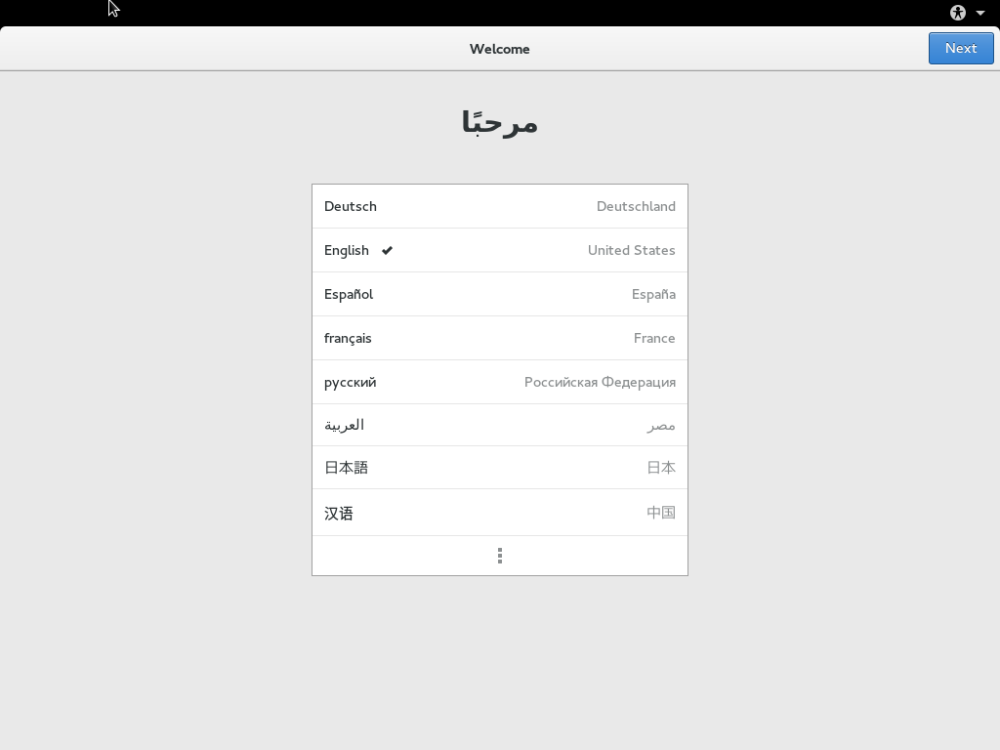

Kto nevytváral nového užívateľa počas inštalácie, má možnosť vytvoriť ho teraz.

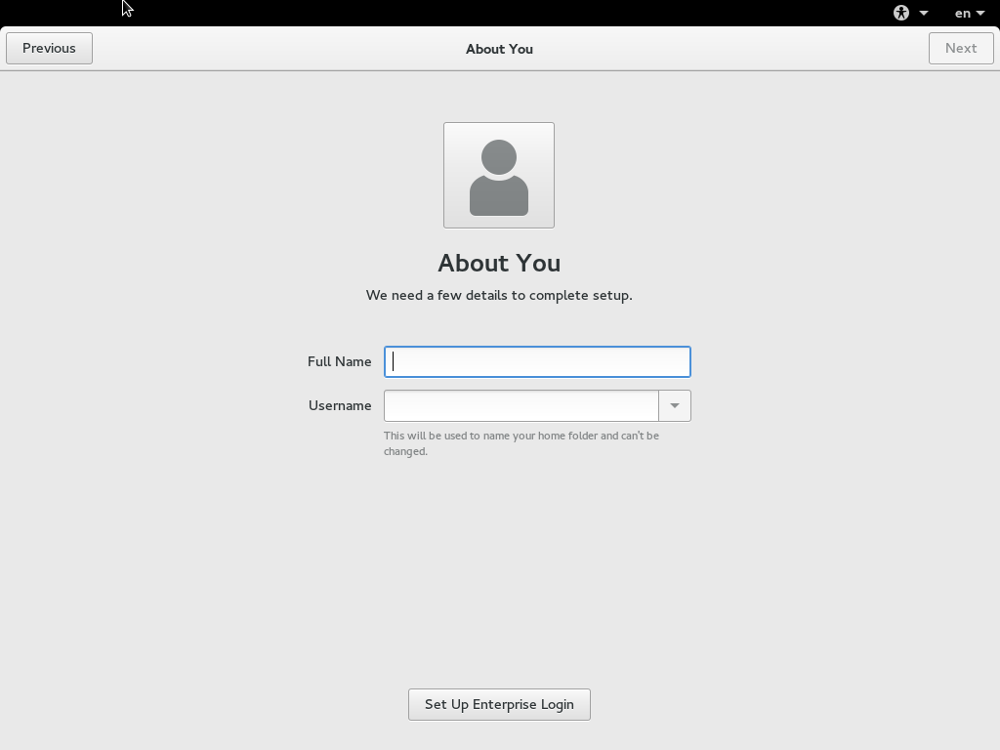

Ja si zadávam meno `matusko`, ktoré neskôr budem spomínať...

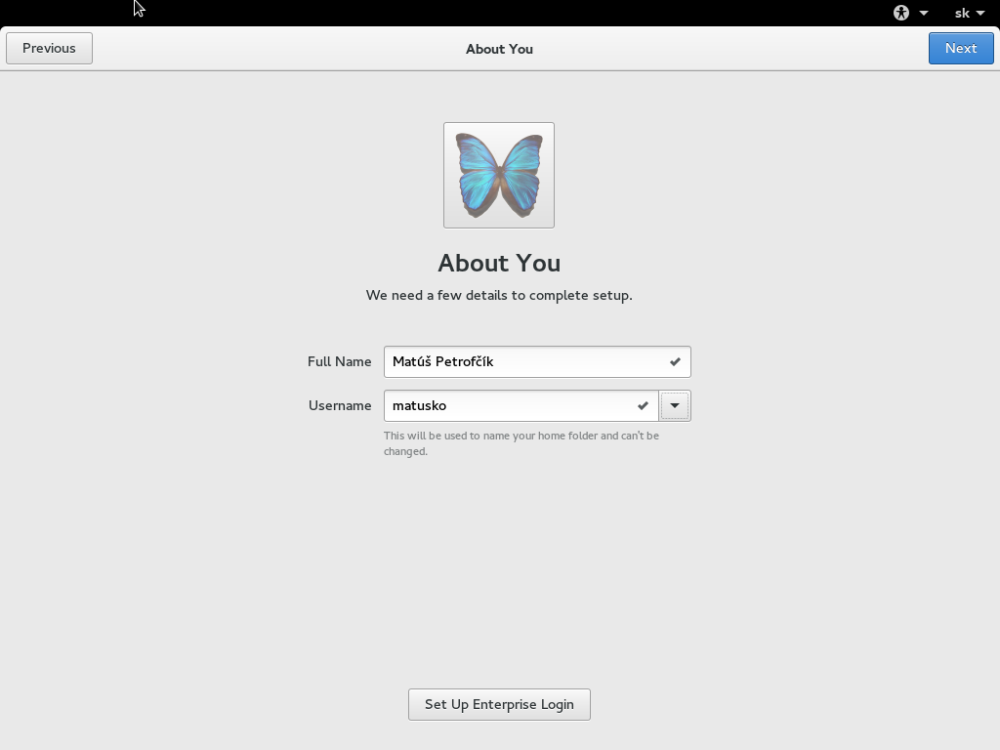

... a nastavujem si hustokruté heslo.

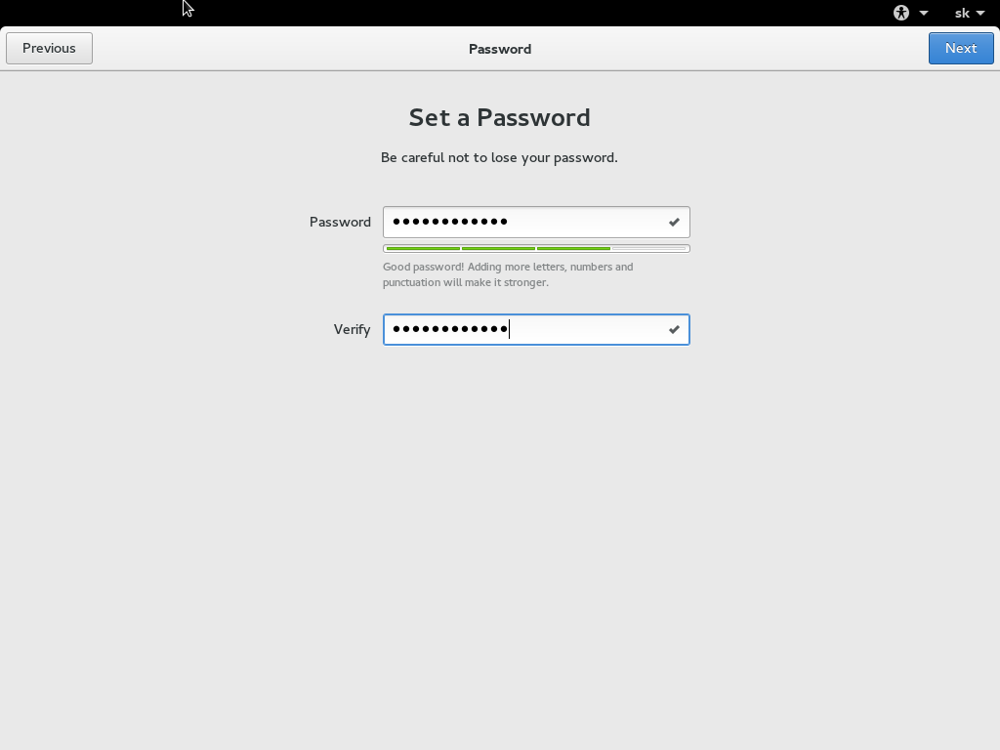

Pri inštalácií sa dali voliť hociaké heslá, no teraz musíme dodržiavať niekoľko bezpečnostných pravidiel.

Po kliknutí na `Next` je všetko nastavené, a po kliknutí na `Start using Fedora` sa môžeme prihlásiť.

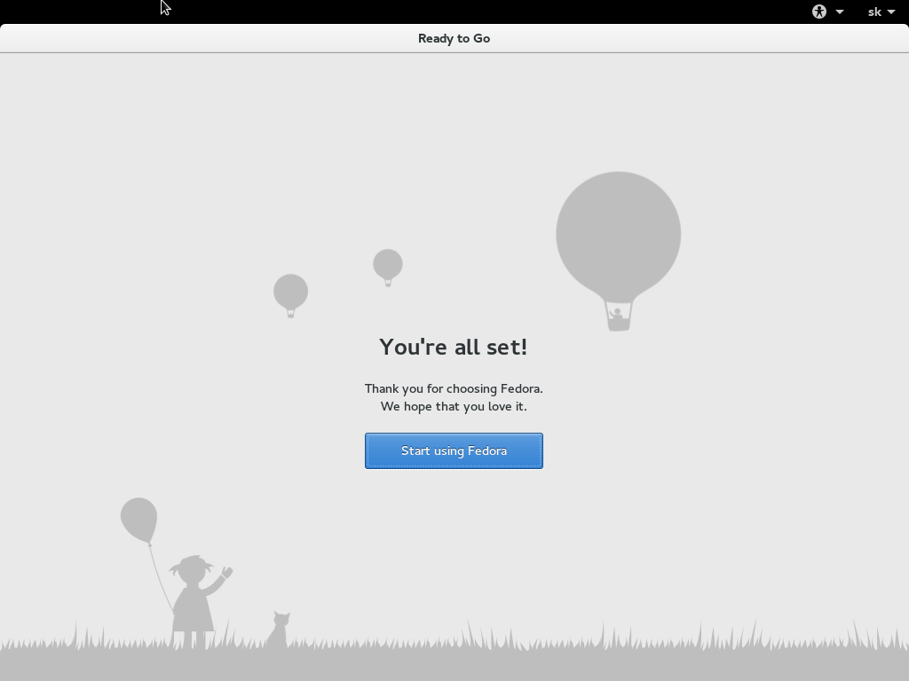

## Prihlásenie

Prihlasovacia obrazovka vyzerá takto:

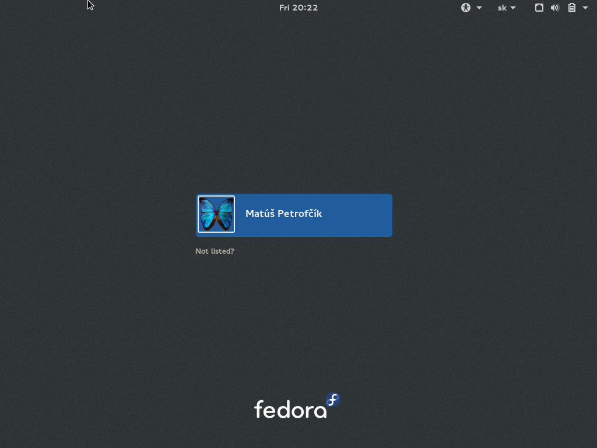

Jenoducho kliknite na svoje meno a zadajte heslo :)

## Update systému

Hneď po spustení systému odporúčam updatovať systém, vďaka čomu získate rôzne vylepšenia
opravy chýb, vyššiu stabilitu systému, atď.

Update je môžne vykonať pomocou programu `Software` z ponuky programov,
no ja vám ukážem ako na to z príkazovej riadky.

Otvorte si teda program `Terminal` a zadajte príkaz:

```
sudo dnf check-update
```

Po výzve na zadanie hesla samozrejme zadajte aj heslo (zadávané heslo sa
v termináli nezobrazuje, a to ani ako hviezdičky, ale zaznamenáva sa).

Až sa posťahuje zoznam vecí na aktualizáciu, môžete zadať ďalší príkaz:

```
sudo dnf -y update
```

Ten updatne systém a to `-y` znamená, že vás ďalej nebude pýtať povolenie.

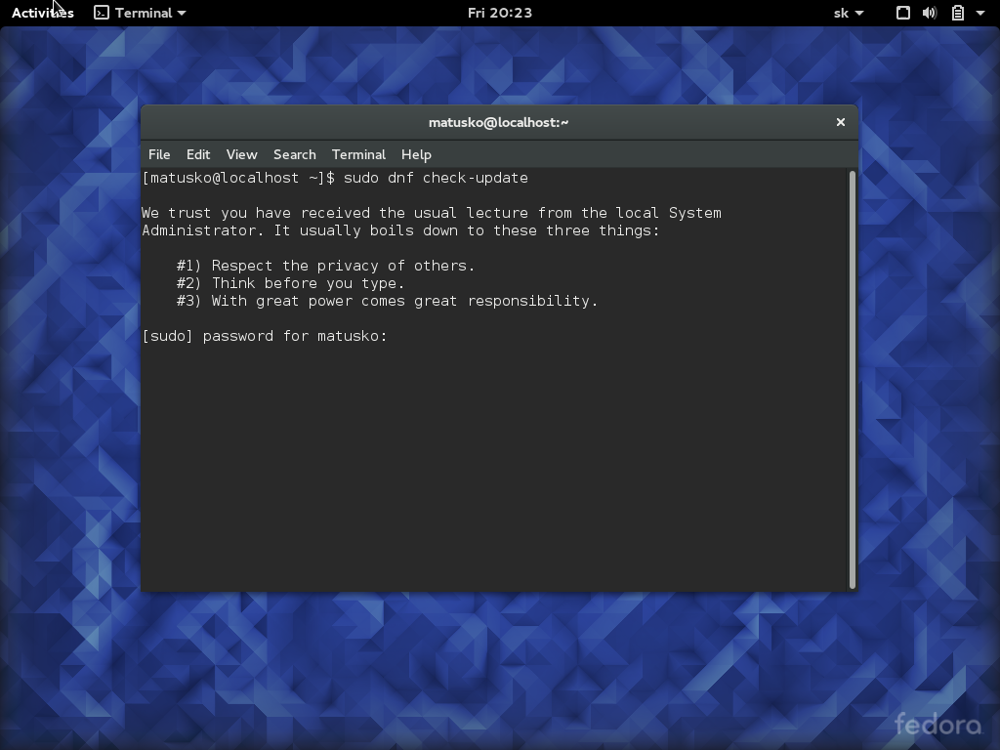
