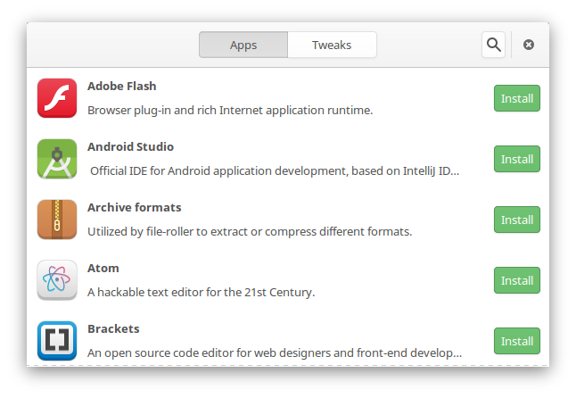

# Neslobodný softvér, Git a SSH

V tejto časti tutoriálu si predstavíme neslobodný softvér v rámci Fedory, nastavíme Git a SSH kľúč.

## Neslobodný softvér

Menším "problémom" Fedory je absencia softvéru, ktorý nechce/nemôže Fedora (alebo skôr Red Hat)
z rôznych dôvodov poskytovať. V základe tak Fedora v repozitároch neobsahuje
softvér ako Adobe Flash Player, Google Chrome, či Microsoft Fonty.

### Fedy

Skvelým riešením je program Fedy, dostupný na stránke [folkswithhats.org](http://folkswithhats.org/).

Ten nám totiž do systému pridá [RPM Fusion repozitáre](http://rpmfusion.org/), ktoré obsahujú chýbajúci
softvér, a k tomu niekoľko ďalších užitočných repozitárov (napr. pre Steam klienta).



Fedy je možné nainštalovať príkazom (skontrolujte si či sa náhodou nezmenil na oficiálnej stránke):

```
bash -c 'su -c "curl http://folkswithhats.org/fedy-installer -o fedy-installer && chmod +x fedy-installer && ./fedy-installer"'
```

Získame tak program s jednoduchým rozhraním pre inštaláciu softvéru, tém, a niekoľko užitočných funkcií (napr. ofarbenie terminálu).

### Pridanie RPM Fusion repozitárov manuálne

Alternatívne si môžete pridať RPM Fusion repozitáre sami.

Odporúčam zájsť na stránku [rpmfusion.org/Configuration](http://rpmfusion.org/Configuration),
na ktorej si môžete stiahnúť konfigurácie pre Free a Nonfree repozitáre, a to s grafickým rozhraním
(ako balíčky RPM), tak aj kódy pre vloženie do terminálu.

Pre úplnosť uvediem rozdiel medzi Free a Nonfree repozitárom:

- **Free** - pre Open Source softvér, ktorý Fedora nemôže dodávať z rôznych dôvodov
- **Nonfree** - pre softvér, ktorý nie je Open Source (zahŕňa aj Open Source softvér, ktorý je zadarmo len pre nekomerčné účely)

### Ostatný softvér

Ak sa vami hľadaný softvér nenachádza v repozitároch, stále je možnosť získať RPM balíček (koncovka .rpm) od výrobcu.

Ako príklad uvediem emailový klient [Nylas N1](https://nylas.com/), ktorý sa dá stiahnúť na stránke [invite.nylas.com/download/](https://invite.nylas.com/download/).

Podobným spôsobom sa dá do systému dostať Google Chrome, Opera, Vivaldi, Skype, a iné.

Balíčky pre Debian (Ubuntu, Linux Mint) s koncovkou .deb pre nás žiaľ neplatia.

## Git

Každý správny vývojár potrebuje svoj vzácny softvér verzovať a zálohovať.

Fedora obsahuje verziovací systém Git, ktorý vytvoril Linus Torvald (správca Linuxu).
V dnešnej dobe je veľmi efektívne spolupracovať na vývoji softvéru v kolektíve práve
pomocou Git-u, a taktiež ho jednoducho zdieľať, napr. na [GitHub-e](https://github.com).

Pre používanie Git-u v našich projektoch si však chceme v Git-e nastaviť užívateľa, teda nás.

Zadajme teda do terminálu nasledujúce 2 príkazy (samozrejme si napíšte vlastné údaje):

```
git config --global user.name 'Matúš Petrofčík'
git config --global user.email 'matus@petrofcik.eu'
```

Prvý nám v systéme nastaví naše meno, a druhý email (pomocou emailu sa potom v GitHub-e pozná užívateľ).

## SSH

Správny vývojár počas svojej práce nezadáva 1000-krát svoje heslo znovu a znovu,
ale overuje svoju totožnosť pomocou SSH kľúča.

Hodí sa nám to pri práci s Git-om, keď ukladáme do vzdialeného repozitára novú verziu
nášho softvéru, ale aj na pripájanie na iné servery a podobne.

Spustime si teda v termináli nasledujúci príkaz:

```
ssh-keygen -t rsa
```

Ten sa bude pýtať na miesto uloženia SSH kľúčov (stlačte enter, netreba meniť), na dodatočnú parafrázu (zadajte ak chcete),
a nakoniec vám vytvorí nové SSH kľúče. Celý proces vyzerá nejako takto:

```
ssh-keygen -t rsa
Generating public/private rsa key pair.
Enter file in which to save the key (/home/matusko/.ssh/id_rsa):
Enter passphrase (empty for no passphrase):
Enter same passphrase again:
Your identification has been saved in /home/matusko/.ssh/id_rsa.
Your public key has been saved in /home/matusko/.ssh/id_rsa.pub.
The key fingerprint is:
4a:dd:0a:c6:35:4e:3f:ed:27:38:8c:74:44:4d:93:67 demo@a
The key's randomart image is:
+--[ RSA 2048]----+
|          .oo.   |
|         .  o.E  |
|        + .  o   |
|     . = = .     |
|      = S = .    |
|     o + = +     |
|      . o + o .  |
|           . o   |
|                 |
+-----------------+
```

V skrytej zložke `/home/matusko/.ssh` teraz máme 2 kľúče, jeden privátny `id_rsa` a jeden verejný `id_rsa.pub`.

Ten privátny nikomu nikdy nedávajte, ale ten verejný si môžete pridať do vášho GitHub účtu,
a nebudete sa už musieť overovať heslom, ale pomocou SSH kľúču, čo vám určite uľahčí život.
